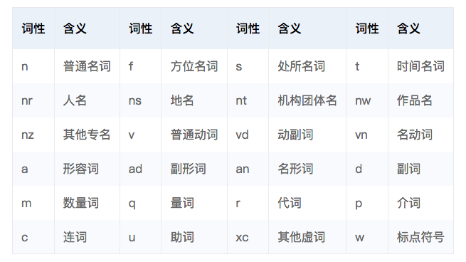

运行本目录下的程序示例需要使用PaddlePaddle v0.13.0 版本。如果您的PaddlePaddle安装版本低于此要求，请按照[安装文档](http://www.paddlepaddle.org/docs/develop/documentation/zh/build_and_install/pip_install_cn.html)中的说明更新PaddlePaddle安装版本。

以下是本例的简要目录结构及说明
```text
.
├── images               # README 文档中的图片
├── data                 # 存储运行本例所需要的数据依赖
├── python               # 存储训练使用的python文件
├── README.md            # 文档
├── src                  # 存储预测使用的C++文件
└── Makefile             # 编译预测库使用的Makefile文件
```

## 简介

中文分词(Word Segmentation)是将连续的自然语言文本，切分出具有语义合理性和完整性的词汇序列的过程。因为在汉语中，词是承担语义的最基本单位，切词是文本分类、情感分析、信息检索等众多自然语言处理任务的基础。
词性标注（Part-of-speech Tagging）是为自然语言文本中的每一个词汇赋予一个词性的过程，这里的词性包括名词、动词、形容词、副词等等。
命名实体识别（Named Entity Recognition，NER）又称作“专名识别”，是指识别自然语言文本中具有特定意义的实体，主要包括人名、地名、机构名、专有名词等。
我们将这三个任务统一为一个序列标注任务，称为词法分析任务，通过采用深度神经网络利用标注语料进行训练，以端到端的模型作为任务的解决方案。

<p align="center">
<br/>
图1. 词性标注说明
</p>


|词性        | 含义           |词性        | 含义           |词性        | 含义           |词性        | 含义          |
| ------------- |-------------| -----| -------------| -------------| -------------| -------------| -------------|
| n  | 普通名词 |  f   |  方位名词 | s   | 处所名词   | t  | 时间名词 |
| nr | 人名    |   ns | 地名      | nt  | 机构团体名 | nw  | 作品名  |
| nz | 其他专名 |   v  | 普通动词  | vd  | 动副词     | vn | 名动词   |
| a  | 形容词   | ad   | 副形词    | an  | 名形词    | d   | 副词    |
| m  | 数量词   | q    | 量词     | r    | 代词     | p   | 介词    |
| c  | 连词    | u     | 助词     | xc  | 其他虚词  | w   | 标点符号 |
<p align="center">
图1. 词性标注说明
</p>

根据模型输出的序列标注结果可以直接得到词汇和实体的边界和类别。
对于序列标注问题，通常：使用基于RNN的网络结构学习特征，将学习到的特征接入CRF完成序列标注。实际上是将传统CRF中的线性模型换成了非线性神经网络。沿用CRF的出发点是：CRF使用句子级别的似然概率，能够更好的解决标记偏置问题。本例也将基于此思路建立模型。


## 模型详解

词法分析任务的输入是"一句话"，目标是识别句子中的词汇和实体边界及类别，我们按照如下方式构建我们的模型。

1. 构造输入，采用one-hot方式表示，每个字以一个id表示
2. one-hot方式的句子序列通过字表，转换为实向量表示的字向量序列；
3. 将步骤2中的字向量序列作为双向GRNN的输入，学习输入序列的特征表示，得到新的特性表示序列，可以选择经过多个双向GRNN以增加学习能力；
4. CRF以步骤3中模型学习到的特征为输入，以标记序列为监督信号，实现序列标注。


## 数据说明

训练使用的数据可以由用户根据实际的应用场景，自己组织数据。数据由两列组成，以指标符分割，第一列是utf8编码的中文文本，第二列是对应每个字的标注，以空格分割。我们采用BIO标注体系，即以X-B作为类型为X的语块的开始，以X-I作为类型为X的语块的持续，以O表示不关注的字。示例如下：

```text
在抗日战争时期,朝鲜族人民先后有十几万人参加抗日战斗  p-B vn-B vn-I n-B n-I n-B n-I w-B nz-B nz-I nz-I n-B n-I d-B d-I v-B m-B m-I m-I n-B v-B v-I vn-B vn-I vn-B vn-I
```

+ 我们仅在`data`目录下的`train_data`和`test_data`文件中放置少数样本用以示例输入数据格式。
+ 本例依赖数据还包括
    1. 输入文本的词典，在`data`目录下，对应`word.utf8.dict`
    2. 对输入文本中特殊字符进行转换的字典，在`data`目录下，对应`q2b.utf8.dict`
    3. 标记标签的词典,在`data`目录下，对应`label.utf8.dict`
   
+ 我们在`reader.py`脚本中完成对原始数据的处理以及读取，主要包括下面几个步骤:
    1. 从原始数据文件中抽取出句子和标签，构造句子序列和标签序列；
    2. 将句子序列中的特殊字符进行转换
    3. 依据词典获取词对应的整数索引。


## 模型训练与预测
下面将介绍如何训练模型，以及如何使用训练好的模型进行预测。
### 训练

1. 准备好数据和字典。请将训练数据放在一个目录下，测试数据放在另一个目录下。如果有多份不同类型的训练语料，可以在训练目录下使用不同的前缀来区分不同的训练数据，比如使用novel_xxx表示小说类的训练语料，使用news_xxx表示新闻类的训练预料，训练支持同时按照一定的比例混合输入各种不同类型的语料。
2. 查看训练支持的不同选项的含义，可以使用

    ```python
    python python/train.py -h
    ```
    查看训练脚本支持的不同选项，通过设置不同的选项，对自己的训练实现定制化。其中以下选项可能较为常用：
    ```text
    --traindata_dir           指定训练数据所在的路径
    --testdata_dir            指定验证数据所在的路径
    --model_save_dir          指定模型保存的路径
    --corpus_type_list        指定使用训练数据目录下哪些类型的语料，如果设置为”“，则会使用全部语料
    --corpus_proportion_list  指定使用训练数据目录下每种语料的比例，与corpus_type_list中的语料类型一一对应
    ```
3. 运行命令 `python python/train.py` ，**需要注意：直接运行使用的是示例数据及默认参数，实际应用时请替换真实的标记数据并修改相应配置项。** 我们可以使用不同选项来改变训练的配置，如只使用新闻语料和标题语料，可以使用命令`python python/train.py --corpus_type_list news title --corpus_proportion_list 0.5 0.5`。


### 预测
1. 因为分词、词性标注和专名识别常常作为其他模块的基础依赖，因此我们提供了C语言的预测接口。使用方式是xxxxxxx

2. 开始测试后，会看到如下预测结果：

    ```text
    cricket             O
    -                   O
    leicestershire      B-ORG
    take                O
    over                O
    at                  O
    top                 O
    after               O
    innings             O
    victory             O
    .                   O
    london              B-LOC
    1996-08-30          O
    west                B-MISC
    indian              I-MISC
    all-rounder         O
    phil                B-PER
    simmons             I-PER
    took                O
    four                O

    ```
    输出分为两列，以“\t” 分隔，第一列是输入的词语，第二列是标记结果。多条输入序列之间以空行分隔。
